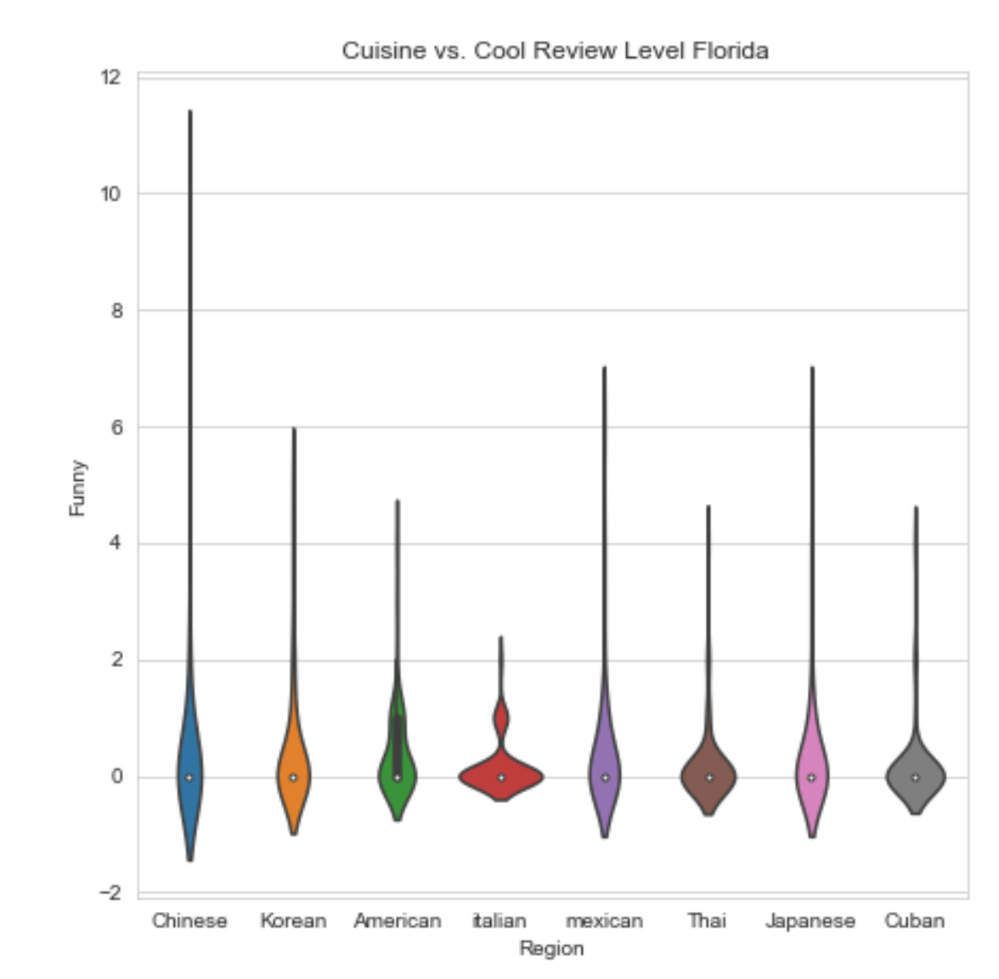
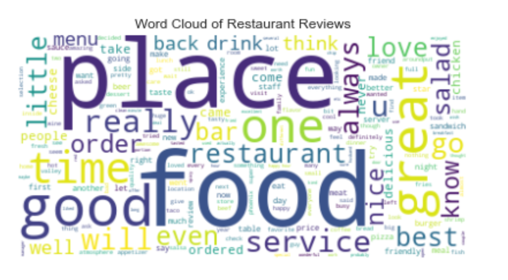
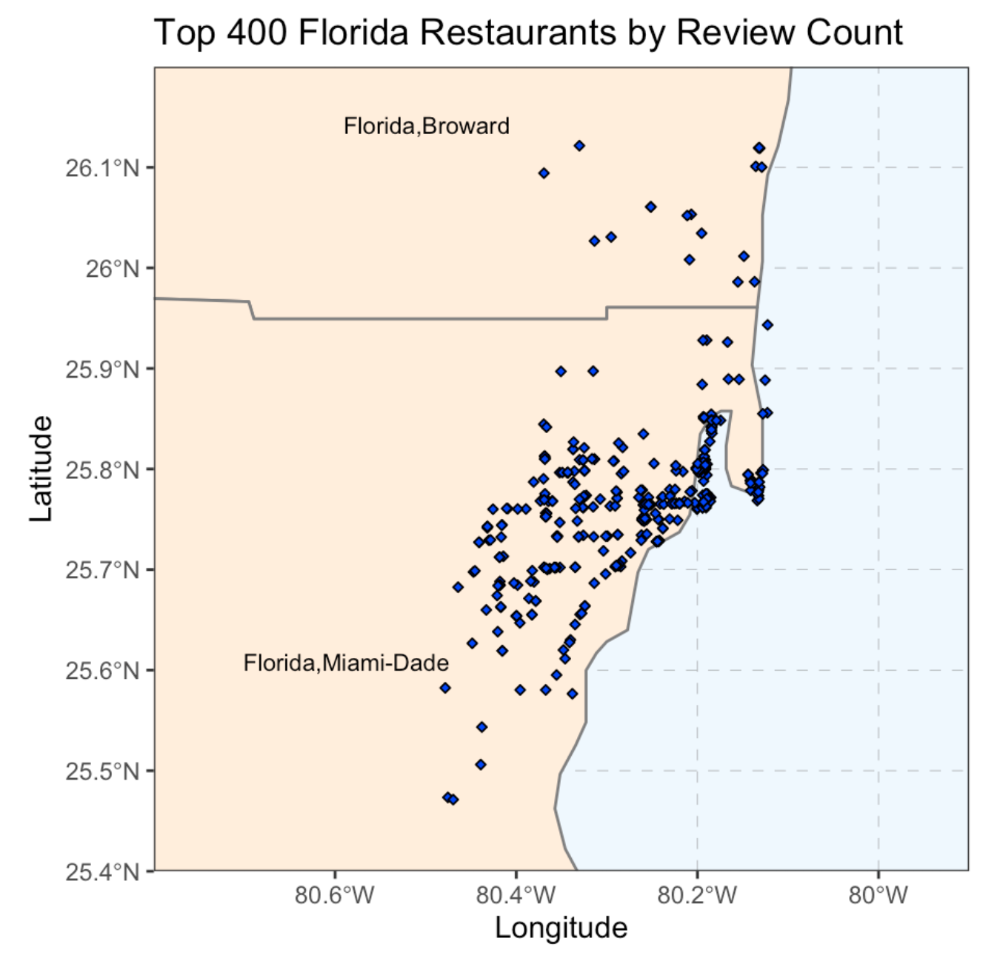
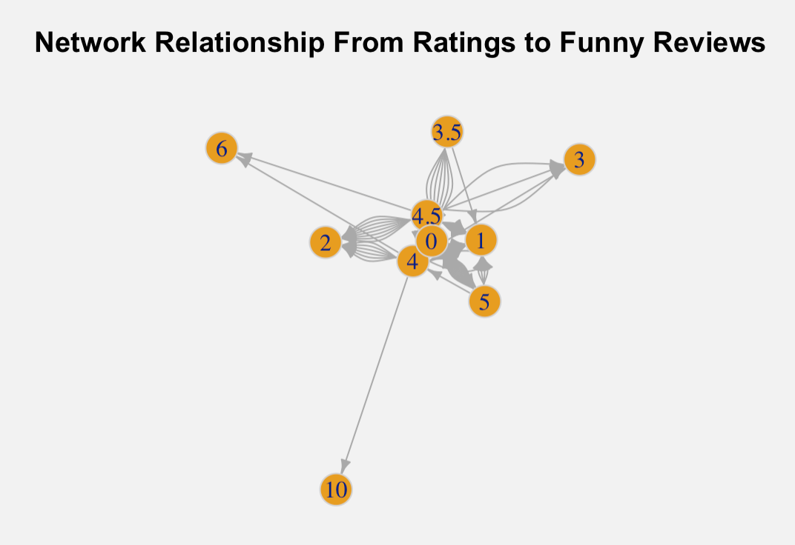

```{r setup, include=FALSE}
library(ggplot2)
library(flexdashboard)

```

About
=======================================================================

- Data:
The yelp data is scraped in Python using Yelp API. And the review data is from Kaggle.com (https://www.kaggle.com/mobasshir/yelpdata).They were merged on the name of restaurants. Because the original dataset is too big, only the data for Virginia is selected for this project.

- Objectives:
The goal of this project is to visualize the distribution of restaurants with top number of reviews by different Cuisine and explore their relationship with their prices, review counts, ratings and the style of the user's comments on Yelp.

- Project Summary:
This project will have several sections based on the plot types and the attributes that are being analyzed as the data have time series, spatial, network attributes that can be visualized in a variety of ways. 


Explorative Data Analysis Summay
=======================================================================

### Violin Plot




Review WordCloud
=======================================================================


### WordCloud of Restaurant Reviews



***
- The word cloud aligns with the expectation that words like "good", "great", "best", "delicious" appear very frequently in the reviews as the popular restaurants tend to have more positive reviews. 
- It can also be noticed that words such as "bar", "drink", "chicken", "fish" and "taco" also appear frequently in the reviews which indicate


Geographical Plots
=======================================================================

### Top Restaurants Distribution in Florida by Review Count




Network Graph
=======================================================================
Row
-----------------------------------------------------------------------



***
- Source: overall rating of restaurants 
- Target: average funny level of the reviews given
- The range of rating is from 1 to 5. The range of funny level of reviews is from 0 to 10.
- Some interesting Observations: Restaurants with ratings of 5 tend to have more 0s and 1s level funny reviews while restaurants with lower rating of 4 and 4.5 tend to have higher average level of funny reviews.
