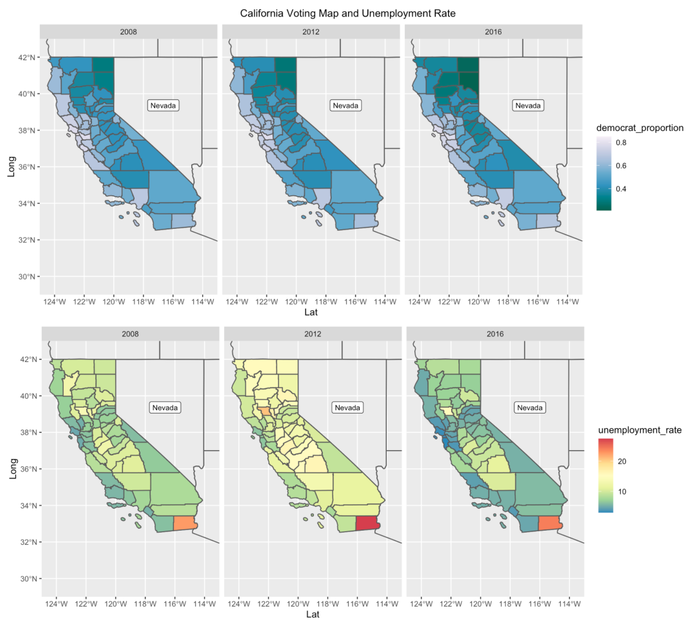
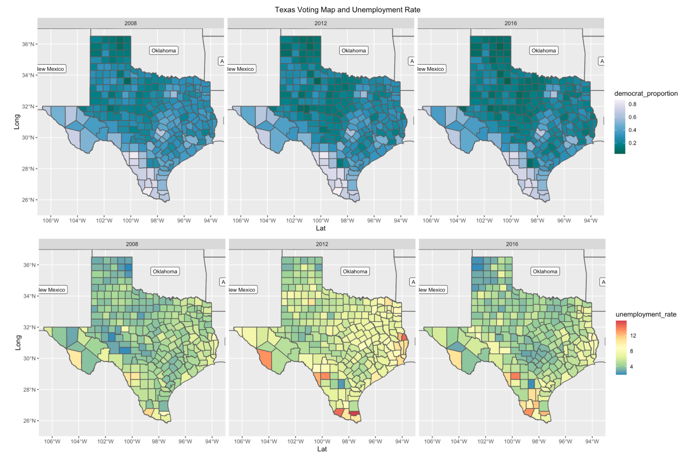
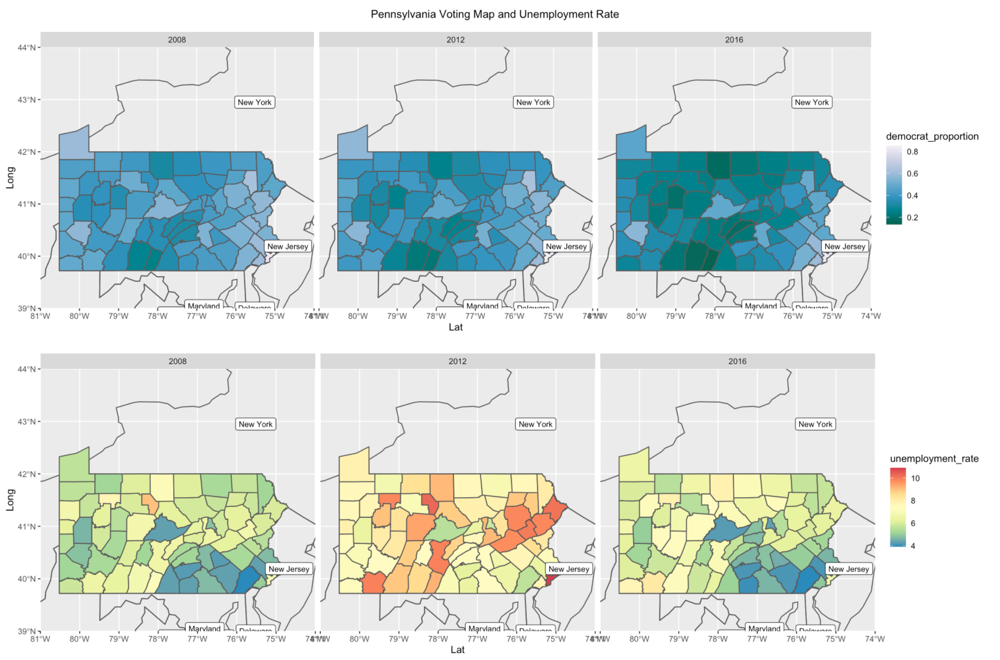

```{r setup, include=FALSE}
knitr::opts_chunk$set(message=FALSE,warning=FALSE, cache=TRUE)
```

This page will walk through major projects I did in ANAL 503.

# Geospatial Visualization Assignment

The goal of this assignment is to visualize historical US election data and unemployment rates across US counties using choropleths. You will create three 3x2 panels of choropleths, one each for Texas, California and Pennsylvania. The rows will correspond to the years 2008, 2012 and 2016, and the columns will correspond to the percent of the vote received either the Democratic or Republican candidate for president (I chose the Democratic), and the unemployment rate in that year.

### [California Voting Map and Unemployment Rate](https://maggie.github.io)

<a href = "https://maggie.github.io">

### [Texas Voting Map and Unemployment Rate](https://maggie.github.io)

<a href = "https://maggie.github.io">


### [Pennsylvania Voting Map and Unemployment Rate](https://maggie.github.io)

<a href = "https://maggie.github.io">


# Network Graph Assignment

The goal of this assignment is to visualize the flow of people between different states in the United States over the period of one year, using network graphs.

 New York, Texas, Virginia and Florica were chosen as the origin states (where people lived the previous year) for this visualization, and show graphically the relative numbers of people that moved to the top 10 destination states (current state, in the data set) from each of the origin states. The nodes represent the states, and the edges represent the volume of people who migrated.


